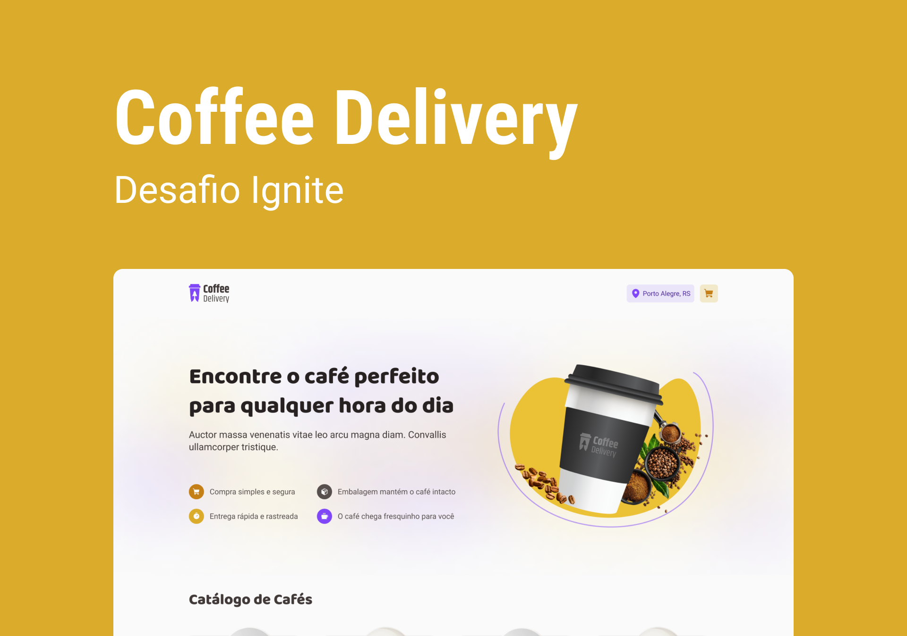

# Coffee Delivery

Coffe Delivery é uma aplicação web para pedidos de café online, desenvolvida com ReactJS.

## Funcionalidades

- Visualizar lista de produtos
- Adicionar e remover produtos do carrinho
- Realizar pedido de café com informações do usuário e pagamento
- Visualizar histórico de pedidos

## Instalação

Clone o repositório: git clone https://github.com/bsvleste/coffe-delivery.git

```bash
Acesse a pasta do projeto: cd coffee-delivery
Instale as dependências: npm install
Inicie a aplicação: npm start
```

## Tecnologias utilizadas

- ReactJS
- TypeScript
- Axios
- Styled Components
- React Hook Form